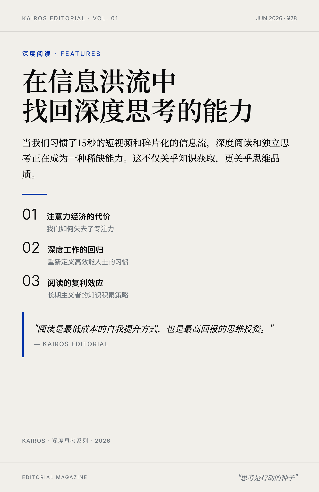

<div align="center">
  
  
  
  <h1>Kairos Skills</h1>
  <p><b>给 AI 套上缰绳，让它按规矩办事</b></p>
  <p>一个高质量、可沉淀的个人 AI skill 集合。每个 skill 自包含、可移植，目标是让 LLM 稳定输出高质量产物。</p>
</div>

<br>

## 30 秒上手

```bash
# 克隆
git clone https://github.com/Kairos0922/kairos-skills.git
cd kairos-skills

# 验证所有 skill
python3 check.py

# 微信排版：一篇 Markdown → 可粘贴到公众号的 HTML（纯标准库，即装即用）
cd kairos-wechat-typeset
python3 scripts/render.py --theme song --input article.md --output article.html

# 视觉卡片：一个主题 → 杂志感视觉卡片
cd kairos-visual-generator
python3 scripts/select_metaphor.py --title "增长" --usage "封面"
```

> 每个 skill 相互独立，无需同时安装。微信排版纯 Python 标准库；视觉卡片生成 PNG 时需要浏览器（`pip install -r requirements-dev.txt && playwright install chromium`），风格路由与隐喻查询本身无需任何依赖。

<br>

## 什么是 Harness？

> AI 每次生成的东西都不一样。第一次好看，第二次变丑，第三次风格又变了。

**Harness = 给 AI 套上缰绳。** 对内容渲染型 skill，用代码写死规则、用 JSON 锁定视觉 token、用验证脚本当门禁；对对话推理型 skill，用清晰的规则和验证标准约束输出质量，而不是靠即兴发挥。

<br>

## Skill 集合

<table>
<tr>
  <td align="center" width="50%">
    <a href="./kairos-wechat-typeset/">
      <br>
      <b>kairos-wechat-typeset</b>
    </a>
    <br>
    <sub>微信公众号排版 · 5 套主题 · Markdown → HTML</sub>
  </td>
  <td align="center" width="50%">
    <a href="./kairos-visual-generator/">
      <br>
      <b>kairos-visual-generator</b>
    </a>
    <br>
    <sub>多风格视觉卡片 · 4 套视觉系统 · 主题 → 图片</sub>
  </td>
</tr>
<tr>
  <td align="center" width="50%">
    <a href="./kairos-loop/">
      <b>kairos-loop</b>
    </a>
    <br>
    <sub>对话顾问型 · 场景 → 高质量 loop prompt · 帮你写规范的自循环任务</sub>
  </td>
  <td align="center" width="50%"></td>
</tr>
</table>

> Skill 有两种形态：**内容渲染型**（kairos-wechat-typeset、kairos-visual-generator，脚本锁定视觉、AI 只做编辑判断）和**对话推理型**（kairos-loop，通过对话产出高质量产物）。集合不强制统一结构——每个 skill 的形态由它的任务决定。

<br>

## 架构（内容渲染型 skill）

```text
用户输入 → LLM 编辑判断（不确定）→ render.py 渲染（确定）→ verify 验证（确定）→ 输出
```

- **LLM 做**：理解需求、选择主题、规划结构、编辑内容
- **代码做**：字号、颜色、字体、间距、渲染、验证
- **LLM 不许做**：生成 HTML、CSS、style、class、自定义颜色

对话推理型 skill 不走这条管线，它的"确定性"来自 SKILL.md 里清晰的规则、追问流程和验证标准。

<br>

## 设计原则

| 原则 | 说明 |
|------|------|
| 只留必需 | 非必需的、或无法确定是否必需的，一律不要 |
| 形态自由 | 不固定 skill 内部结构，约束只针对质量和可移植性 |
| 自动发现 | 加 skill = 丢个目录，`check.py` 自动发现，不改中心清单 |
| 确定性优先 | 渲染型 skill 由脚本决定视觉，AI 只做编辑判断 |
| 自包含 | 每个 skill 独立，不依赖私有路径或跨 skill 共享目录 |

<br>

## 验证

```bash
python3 check.py          # 自动发现所有 skill，跑基线检查 + 各自的 validate.sh
python3 check.py --smoke  # 只做基线检查（frontmatter 合法 + 无私有路径/密钥）
```

CI 已在 push / PR 时自动运行 `python3 check.py`。

新增 skill 只需：建目录、写 `SKILL.md`（含 frontmatter）、需要深度验证就加 `validate.sh`。详见 [`AGENTS.md`](./AGENTS.md)。

<br>

## 许可证

MIT
