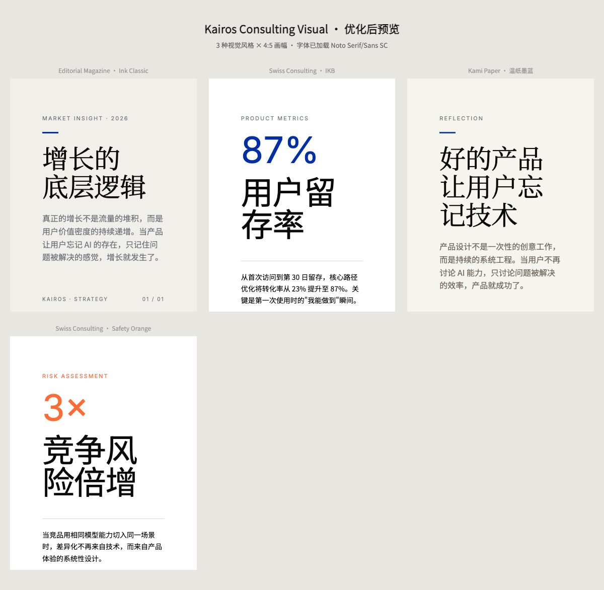

<div align="center">
  
  
  
  <h1>Kairos Skills</h1>
  <p><b>给 AI 套上缰绳，让它按规矩办事</b></p>
  <p>确定性的 AI 内容生产工作流。AI 只做编辑判断，视觉系统由代码和契约决定。</p>
</div>

<br>

## 30 秒上手

```bash
# 克隆
git clone https://github.com/Kairos0922/kairos-skills.git
cd kairos-skills

# 微信排版：一篇 Markdown → 可粘贴到公众号的 HTML
cd kairos-wechat-typeset
python3 scripts/render.py --theme song --input article.md --output article.html

# 视觉卡片：一个主题 → 杂志感视觉卡片
cd kairos-visual-generator
python3 scripts/select_metaphor.py --title "增长" --usage "封面"
```

<br>

## 什么是 Harness？

> AI 每次生成的东西都不一样。第一次好看，第二次变丑，第三次风格又变了。

**Harness = 给 AI 套上缰绳。** 用代码写死规则，用 JSON 锁定视觉 token，用验证脚本当门禁。

<table>
<tr>
  <td align="center" width="50%">
    <b>没有 Harness</b><br>
    <sub>每次输出不同 · 颜色乱配 · 样式靠运气</sub>
  </td>
  <td align="center" width="50%">
    <b>有 Harness</b><br>
    <sub>每次输出相同 · 只能从预设选 · 有验证门禁</sub>
  </td>
</tr>
</table>

<br>

## 两个 Skill

<table>
<tr>
  <td align="center" width="50%">
    <a href="./kairos-wechat-typeset/">
      <br>
      <b>kairos-wechat-typeset</b>
    </a>
    <br>
    <sub>微信公众号排版 · 4 套主题 · Markdown → HTML</sub>
  </td>
  <td align="center" width="50%">
    <a href="./kairos-visual-generator/">
      <br>
      <b>kairos-visual-generator</b>
    </a>
    <br>
    <sub>多风格视觉卡片 · 3 套视觉系统 · 主题 → 图片</sub>
  </td>
</tr>
</table>

<br>

## 架构

```text
用户输入 → LLM 编辑判断（不确定）→ render.py 渲染（确定）→ verify 验证（确定）→ 输出
```

- **LLM 做**：理解需求、选择主题、规划结构、编辑内容
- **代码做**：字号、颜色、字体、间距、渲染、验证
- **LLM 不许做**：生成 HTML、CSS、style、class、自定义颜色

<br>

## 设计原则

| 原则 | 说明 |
|------|------|
| 确定性优先 | 脚本决定视觉，AI 只做编辑判断 |
| 美学保护 | 不允许自定义颜色，不允许即兴写样式 |
| 反模式驱动 | Bad/Fix 对照比正向规范更有效 |
| 分层加载 | 按任务复杂度读取不同深度的规范 |
| 自包含 | 每个 skill 独立，不依赖私有路径 |

<br>

## 贡献

欢迎贡献。详见 [`CONTRIBUTING.md`](./CONTRIBUTING.md)。

<br>

## 许可证

MIT
