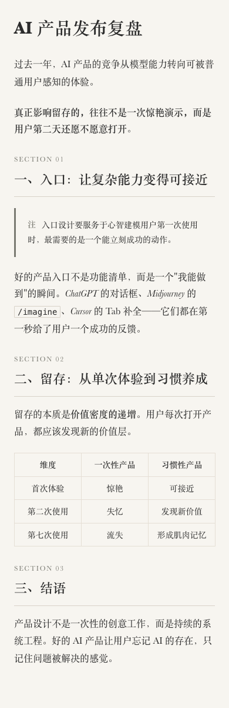

<div align="center">
  
  
  
  <h1>Kairos Skills</h1>
  <p><b>给 AI 套上缰绳，让它按规矩办事</b></p>
  <p>确定性的 AI 内容生产工作流。AI 只做编辑判断，视觉系统由代码和契约决定。</p>
</div>

<br>

## 什么是 Harness？

> AI 每次生成的东西都不一样。第一次好看，第二次变丑，第三次风格又变了。
> 因为 AI 每次都在即兴发挥——没有固定标准，每次从零猜。

**Harness = 给 AI 套上缰绳。** 用代码写死规则，用 JSON 锁定视觉 token，用验证脚本当门禁。AI 只能在约束内做编辑判断，不能越界。

<table>
<tr>
  <td align="center" width="50%">
    <b>没有 Harness</b><br>
    每次输出不同 · 颜色乱配 · 样式靠运气
  </td>
  <td align="center" width="50%">
    <b>有 Harness</b><br>
    每次输出相同 · 只能从预设选 · 有验证门禁
  </td>
</tr>
</table>

<br>

## 两个 Skill

<table>
<tr>
  <td align="center" width="50%">
    <a href="./kairos-wechat-typeset/">
      <br>
      <b>kairos-wechat-typeset</b>
    </a>
    <br>
    <sub>微信公众号排版 · 4 套主题 · Markdown → HTML</sub>
  </td>
  <td align="center" width="50%">
    <a href="./kairos-consulting-visual-generator/">
      <br>
      <b>kairos-consulting-visual-generator</b>
    </a>
    <br>
    <sub>商业视觉卡片 · 12 套预设 · 主题 → 图片</sub>
  </td>
</tr>
</table>

<br>

## 快速开始

```bash
git clone https://github.com/Kairos0922/kairos-skills.git
cd kairos-skills

# 微信排版
cd kairos-wechat-typeset
python3 scripts/render.py --theme song --input article.md --output article.html

# 咨询卡片
cd kairos-consulting-visual-generator
python3 scripts/select_metaphor.py --title "增长" --usage "封面"
```

<br>

## 项目结构

```text
kairos-skills/
├── kairos-wechat-typeset/          # 微信公众号排版
│   ├── SKILL.md                    #   机器指令
│   ├── CHEATSHEET.md               #   一页速查
│   ├── PRODUCT.md                  #   设计决策
│   ├── themes/                     #   4 套主题 JSON
│   ├── scripts/                    #   渲染 + 验证
│   └── references/                 #   反模式 + 路由 + Recipe
│
└── kairos-consulting-visual-generator/  # 商业视觉卡片
    ├── SKILL.md                    #   机器指令
    ├── CHEATSHEET.md               #   一页速查
    ├── PRODUCT.md                  #   设计决策
    ├── references/                 #   设计规范 + 方法论
    └── scripts/                    #   隐喻选择 + 验证
```

<br>

## 设计原则

1. **确定性优先** — 脚本决定视觉，AI 只做编辑判断
2. **美学保护** — 不允许自定义颜色，不允许即兴写样式
3. **反模式驱动** — Bad/Fix 对照比正向规范更有效
4. **分层加载** — 按任务复杂度读取不同深度的规范
5. **自包含** — 每个 skill 独立，不依赖私有路径

<br>

## 许可证

MIT
