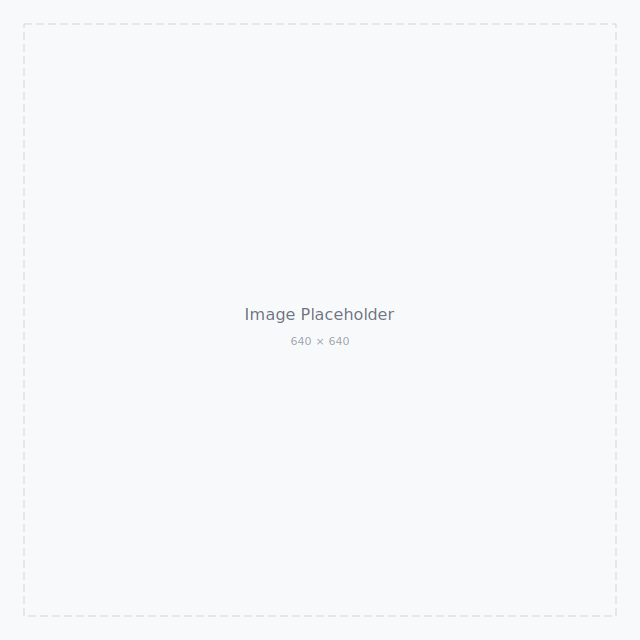
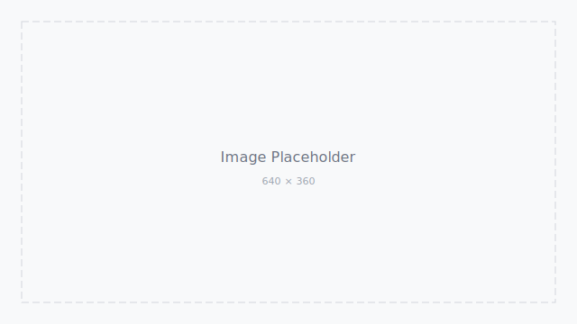

# 在不确定的世界里，寻找确定的自己

:::lead
与内心对话，建立稳定的内在秩序。
:::

原创　公众号名称　2024.05.20 10:00　上海



我们生活在一个充满不确定性的时代，信息爆炸、节奏飞快、选择过载，焦虑和迷茫成为了常态。

## 01 接纳不确定性，是成长的开始

不确定性并不可怕，抗拒不确定性才是痛苦的根源。

:::figure

图 / 山间的晨雾：不确定中的诗意
:::

> 生活从来不是确定的，学会与不确定共处，才能看见更多可能。

当我们停止对确定性的执着，内心反而会生出更多的柔软与弹性。

## 02 建立内在秩序，成为自己的锚点

外在的世界无法掌控，内在的秩序才是我们能真正依靠的。

:::insight
真正稳定的不是环境，而是面对变化时仍能回到自己的能力。
:::

### 每日练习

- 给自己十分钟安静时间。
- 写下今天最重要的一件事。
- 把无法控制的事放回世界，把能行动的事带回自己。

有序步骤：

1. 观察情绪，不急着评判。
2. 命名问题，拆出可行动部分。
3. 完成一个小动作，让秩序重新开始。

任务清单：

- [x] 已完成的任务
- [x] 进行中的任务
- [ ] 待完成的任务

## 03 文字样式

# H1 标题一级

## H2 标题二级

### H3 标题三级

正文用于承载主要解释，保持稳定、克制、清晰的阅读节奏。这里包含 **加粗重点**、*柔和语气*、`inline code`、[参考链接](https://example.com/wending-paper)、~~删去的旧判断~~ 和 ==关键句==。

> [!NOTE]
> 辅助说明用于解释背景、补充上下文，适合放在读者需要停一下的位置。

> [!TIP]
> 如果一段文字的信息密度过高，先拆成短段，再考虑是否需要列表、图注或引用。

> [!WARNING]
> 不要在 Markdown 中写入 HTML、`style` 或 `class`。

## 04 代码样式

```javascript
function greet(name) {
  const message = `Hello, ${name}!`;
  return message;
}

console.log(greet("WeChat"));
```

内联代码示例：使用 `const` 定义不可变的常量。

## 05 表格样式

| 项目 | 说明 | 状态 | 负责人 | 截止时间 |
| --- | --- | --- | --- | --- |
| 需求评审 | 明确需求范围 | 已完成 | 张三 | 2024-05-01 |
| 设计输出 | 完成视觉稿 | 进行中 | 李四 | 2024-05-10 |
| 开发实现 | 前端开发 | 待开始 | 王五 | 2024-05-20 |

---

## 06 引用样式

:::pullquote
生活从来不是确定的，学会与不确定共处，才能看见更多可能。
:::

## 07 延伸阅读

:::soft-list
- 《不确定世界里的确定感》：理解稳定感从哪里来。
- 《设计中的细线秩序》：观察灰度、间距和层级如何建立信任。
- 《每日复盘》：把复杂日常整理成可行动的下一步。
:::

:::closing-note
愿我们都能在不确定的世界里，守住内在秩序，成为自己的锚点。
:::
